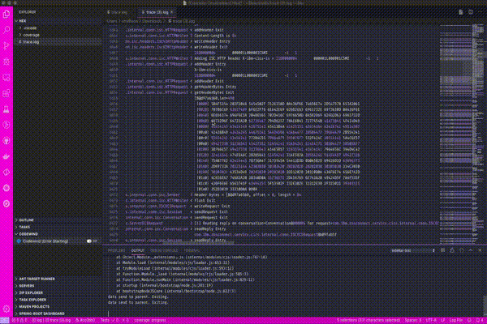

# hexdump-viewer README

VSCode extension for viewing hexdumps from Liberty traces with ISO8859-1 and EBCDIC 037 translation.

## Features

Select the hex characters that you want to view and select `View selected hex...` from the command pallette.

## Installing

1. Download the latest vsix file from the [releases](https://github.ibm.com/zOSConnectEE/hexdump-viewer/releases) page.
1. [Install](https://code.visualstudio.com/docs/editor/extension-gallery#_install-from-a-vsix) into Visual Studio Code

## Release Notes

### 0.1.0

Initial release of based on function from [vscode-hexdump](https://github.com/stef-levesque/vscode-hexdump) and [hexy.js](https://github.com/a2800276/hexy.js).
